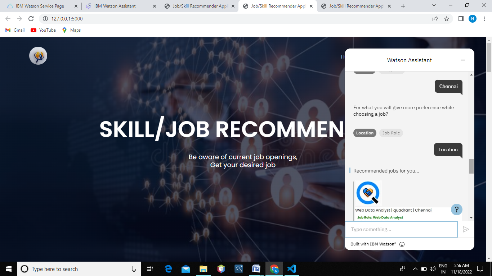
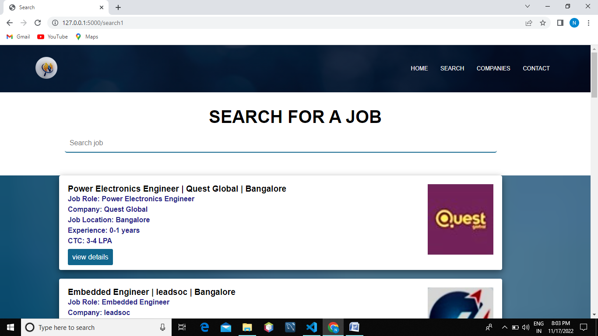
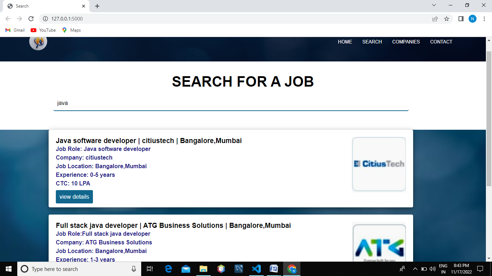
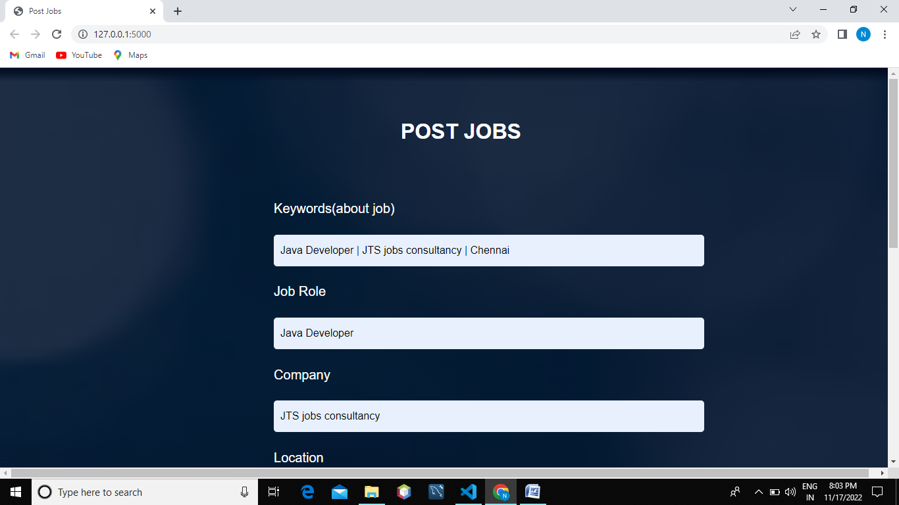
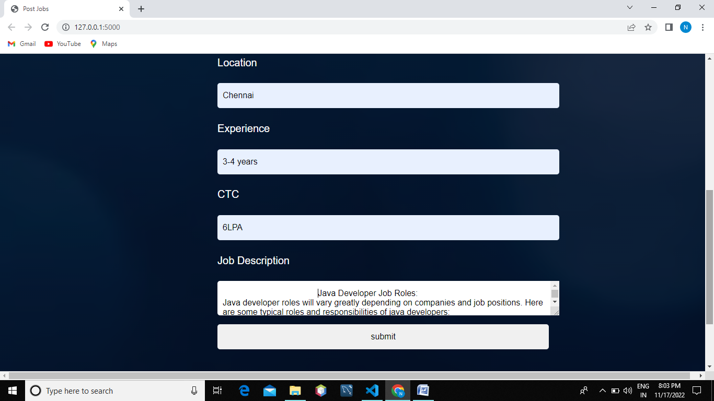
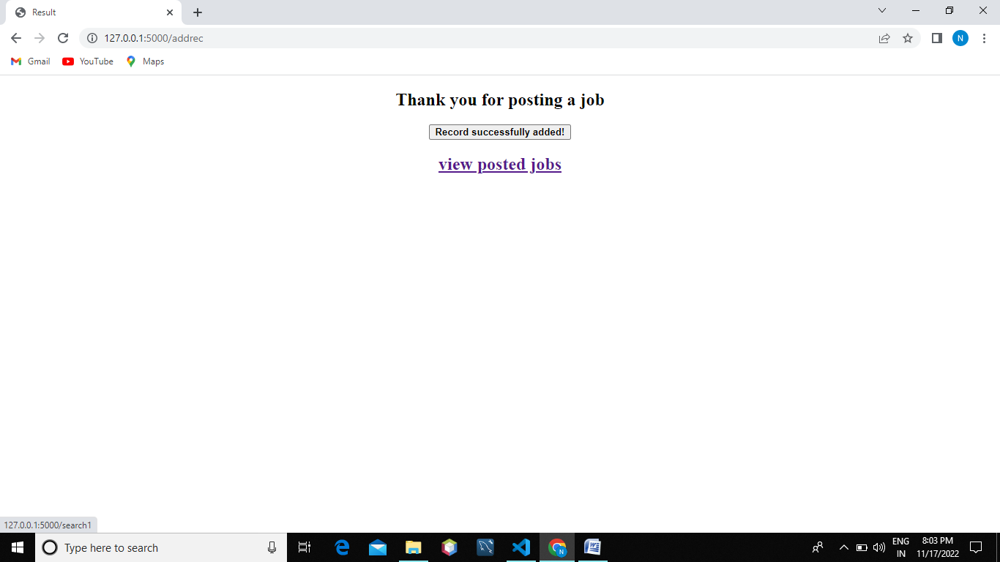
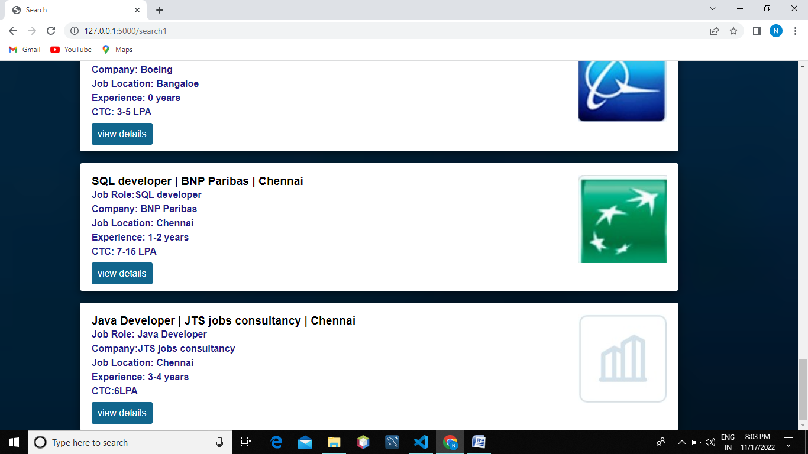

 
JOB RECOMMENDER APPLICATION

     Job recommendation application with intelligence of chatbot. 
In this system, we demonstrate a chatbot that uses Artificial Intelligence to produce dynamic responses to online client enquiries.
This web-based platform provides a vast intelligent base that can help humans to solve problems. 
The chatbot recognizes the user’s context, which prompts an intended response. Because this is a dynamic response, the user’s desired response will be generated. 
This also uses a machine-learning algorithm to learn the chatbot by experiencing various requests and responses. 
Chatbots come to use in numerous fields of our daily life. Because AI enhances the human touch in every communication, chatbot are becoming increasingly robust. 
It triggers accurate responses after understanding a user’s query. 
Its objective is to reduce human dependency in every organization and reduce the need for different systems for different processes.
    Job seekers struggling to get the desired job for skills they have. 
we are proposing an application which will help the students to give Suggestions on the jobs based the skills. 
    In this application freshers or skilled person can sign up and find the jobs by using either the search option or they can directly interact with the chatbot and get their dream job. 
An alert is sent when there is an opening based on the user skillset.      
     Users can interact with the chatbot and get the recommendations based on their skills. 

SCREENSHOTS:

